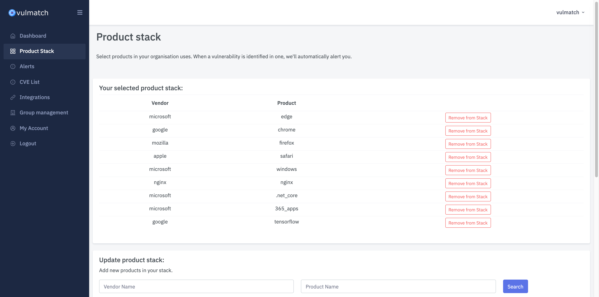
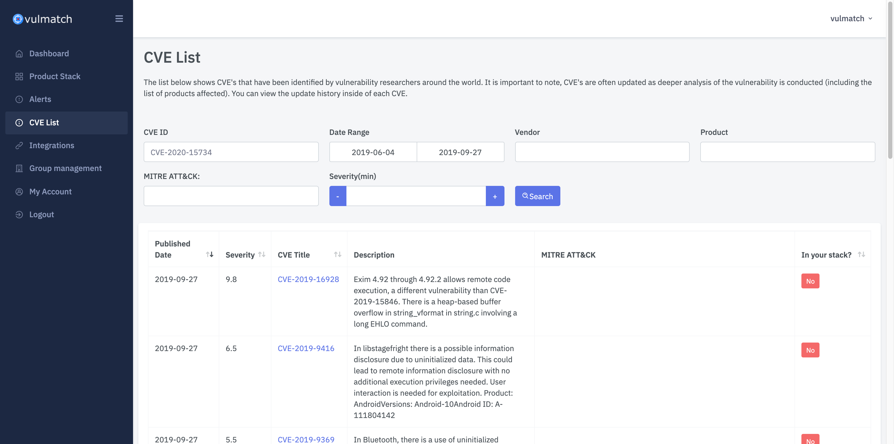
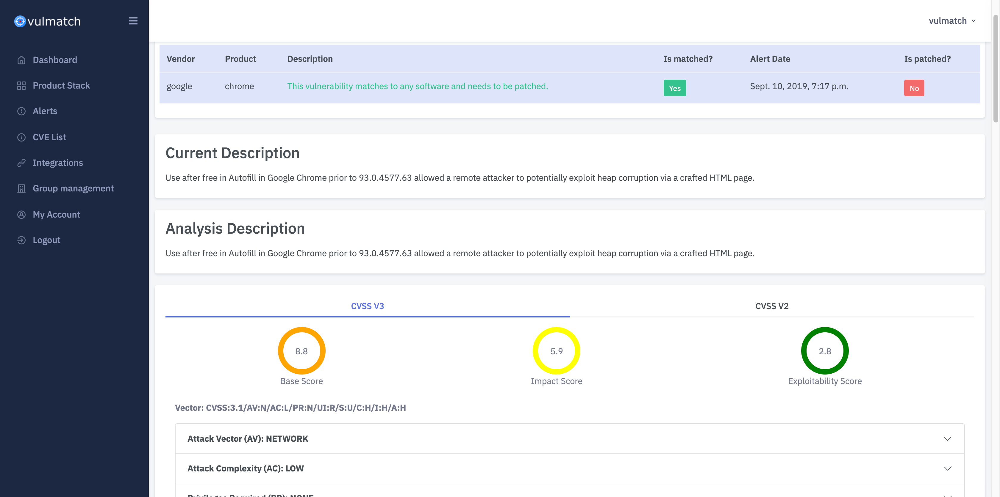
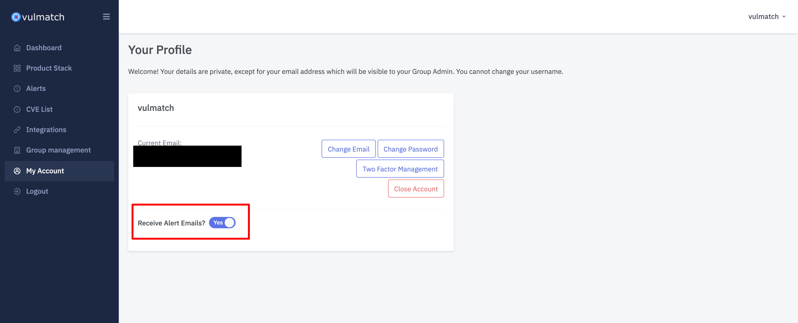

# Content Management

## CVE's

As soon as a CVE is published, it is ingested into Vulmatch.

It is important to note, CVE's are often updated as deeper analysis of the vulnerability is conducted \(including the list of products affected\). All published updates are also immediatley ingested by Vulmatch. You can view the update history inside of each CVE.

## Product Stack

You can add products \(software / hardware\) you use.

Vulmatch does not currently allow for selection of individual product versions.

Go here to add a product to your stack: [https://app.vulmatch.com/software](https://app.vulmatch.com/software)

## Alerts

Alerts are triggered based on products in your stack.

For every product selected, Vulmatch will check against newly identified and updated CVE's for a match.

If a CVE matches a configured alert, the alert is triggered. When an alert is triggered you will receive an email and it will show listed on the individual alert page. You can also query triggered alerts using the API \(only available if enabled for your plan\).

### Alert statuses

Alerts have two statuses:

* Unpatched
* Patched

When an alert is created it has an Unpatched status. You can mark an alert as patched \(or resolved\) in Vulmatch at any time.

#### Alert email settings

If you do not want to receive enabled email alerts for your group, you can disable them under "My Profile".
