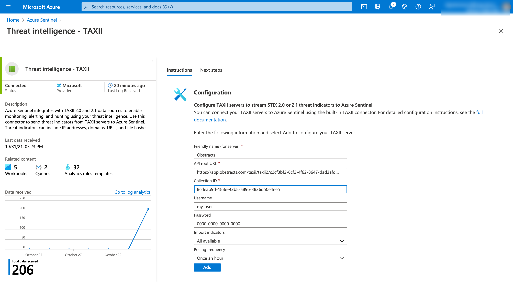

# Microsoft Azure Sentinel

### Prerequisites

[A Vulmatch plan that supports use of our API.](https://www.vulmatch.com/pricing/)

### Setup

This integration uses the STIX/TAXII 2.x data Connector for Azure Sentinel which comes as standard in Azure Sentinel deployments.

1. Navigate to the Threat Intelligence - TAXII connector&#x20;
2. Select add new
3. Set the following field values:
   1. **Friendly name (for server):** Will be shown against intelligence ingested, but can be anything you like
   2. **API root URL:** It’s easy to construct the Root URL. You just need your Vulmatch Group UUID, [obtained on the Group Management page in the Vulmatch web app](https://app.vulmatch.com/user/manage\_group).
      * https://app.vulmatch.com/taxii/taxii2/YOUR-GROUP-UUID
   3. **Collection UUID:** The Collection UUID is a represents an alert UUID in Vulmatch and can be obtained on the CVE page (of the CVE that triggered the alert).
   4. **Username:** your Vulmatch username
   5. **Password:** your Vulmatch API key
   6. **Import indicators:** Select, "At most one month old" (or sooner). _Important: We do not allow download of older indicators._
   7. **Polling frequency:** Select, "1 hour".

Now click save, and you should see intelligence being ingested.&#x20;

### Usage

Once data connector is enabled, the ingested threat intelligence will be used by active rules in Azure Sentinel that utilise threat intelligence.
